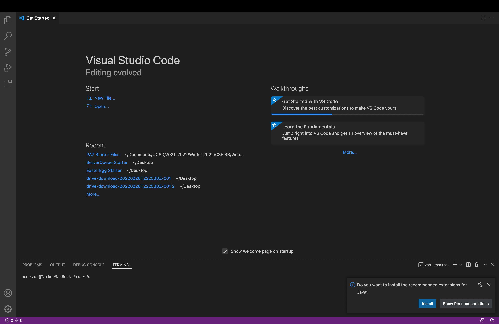
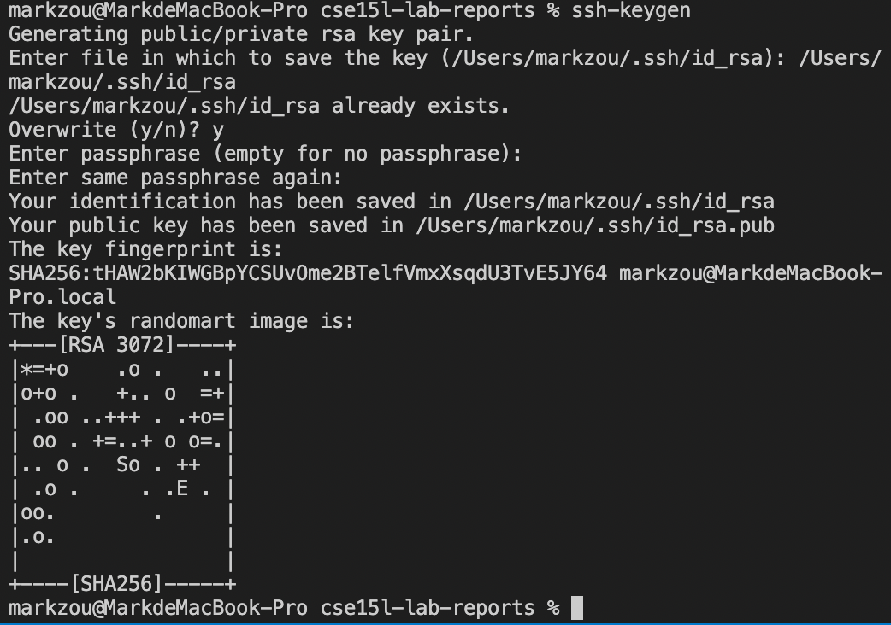
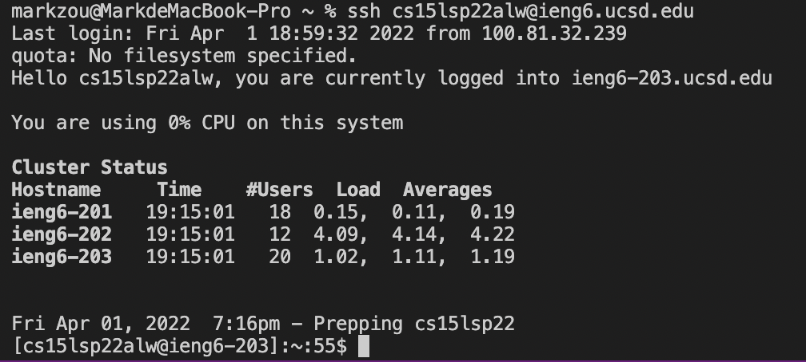

# Week 2 Lab Report 

## Part 1 - Installing VScode
* First, you need to download VScode from [this link](https://code.visualstudio.com/). 

* After you have successfully downloaded and installed VScode, you should be able to open it and see an image like this. 


## Part 2 - Remotely connecting
Note: For students who are using Windows, please install a program called OpenSSH beforehead.

[Install OpenSSH](https://docs.microsoft.com/en-us/windows-server/administration/openssh/openssh_install_firstuse)

Now, let's begin to connect to remote computer.
* First find out your personal account from [here](https://sdacs.ucsd.edu/~icc/index.php)

* Then open terminal in VScode, and type in this command with your own account:

    `ssh cs15lsp22alw@ieng6.ucsd.edu`
* After successful log in, you may see this from your terminal:


## Part 3 - Run some commands
Try some commands to be familiar with unix system.
Here are several useful commands:
* cd
* cd ~
* ls
* ls -lat
* ls -a
* cp /home/linux/ieng6/cs15lsp22/cs15lsp22alw/WhereAmI.java

After running these commands, you might expect get these things:


## Part 4 - Moving Files with `scp`
In this part, we are going to learn how to move a file from user's computer to server's computer.

* First, create a file on you personal computer called `WhereAmI.java` and fill following content in it:
    ```
    class WhereAmI{
        public static void main(String[] args){
            System.out.println(System.getProperty("os.name"));
            System.out.println(System.getProperty("user.name"));
            System.out.println(System.getProperty("user.home"));
            System.out.println(System.getProperty("user.dir"));
            
        }
    }
    ```
* Run this file using commands `javac` and `java` on your personal computer. Have a look about what you get from this file.

* In the terminal from the directory where you stored your 'WhereAmI.java' file, run the following command: 

    `scp WhereAmI.java /home/linux/ieng6/cs15lsp22/cs15lsp22alw: ~/`


* After you typing the correct password, you log in ieng6 again and you should be able to find `WhereAmI.java` file in home directory like this.


* Now, try to run this file again on sever computer and see what has been changed from result of this time.

## Part 5 Setting an SSH key

So far, every time when we are trying to log in remote computer, we nned to type in password, which is frustrating and time-consuming. In this section, we are going to introduce a way 


* On your local computer, type in following command to find a pair of key.

    ```
    markzou@MarkdeMacBook-Pro cse15l-lab-reports % ssh-keygen         
    Generating public/private rsa key pair.
    Enter file in which to save the key (/Users/markzou/.ssh/id_rsa): /Users/markzou/.ssh/id_rsa
    Enter passphrase (empty for no passphrase): 
    Enter same passphrase again: 
    Your identification has been saved in /Users/markzou/.ssh/id_rsa
    Your public key has been saved in /Users/markzou/.ssh/id_rsa.pub
    The key fingerprint is:
    SHA256:tHAW2bKIWGBpYCSUvOme2BTelfVmxXsqdU3TvE5JY64 markzou@MarkdeMacBook-Pro.local
    The key's randomart image is:
    +---[RSA 3072]----+
    |*=+o    .o .   ..|
    |o+o .   +.. o  =+|
    | .oo ..+++ . .+o=|
    | oo . +=..+ o o=.|
    |.. o .  So . ++  |
    | .o .     . .E . |
    |oo.        .     |
    |.o.              |
    |                 |
    +----[SHA256]-----+
    ```
    

* Two files are created on your system. `id_rsa` stores a private key, and `id_rsa.pub` stores a public key.
* We need to copy the public key to the ` .ssh` directory of your own sever account.
    ```
    % ssh cs15lsp22alw@ieng6.ucsd.edu
    $ Password: 
    $ mkdir .ssh
    $ <logout>
    # back to client
    % scp /Users/markzou/.ssh/id_rsa.pub cs15lsp22alw@ieng6.ucsd.edu:~/.ssh/authorized_keys
    ```
* Now you should be able to log in without typing password like this:


## Part 6 Optimizing Remote Running

Using what you have learned from previous 5 parts, try to come up with the most convenient commands to make a local change on `WhereAmI.java`, copy changed files to server computer and run it.

Several Hints:
1. `ssh cs15lsp22alw@ieng6.ucsd.edu "ls"`

    This command allows you to log in your server account and list the home directory of your account.
2. `cp WhereAmI.java OtherMain.java; javac OtherMain.java; java WhereAmI`
    Use semicolons, you are able to call several commands at the same time. 
3. You can use up-arrow on keyboard to recall previous commands that have been run.


