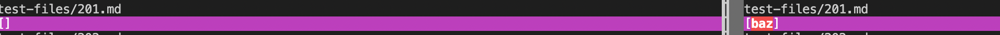
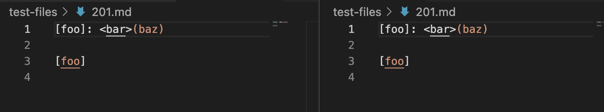
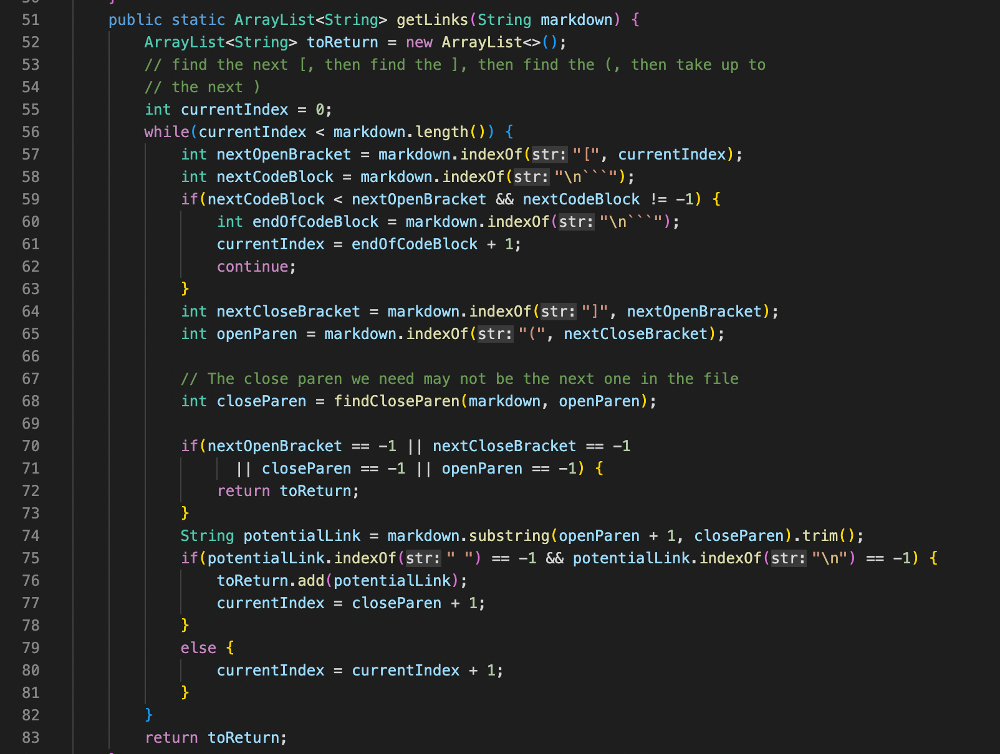
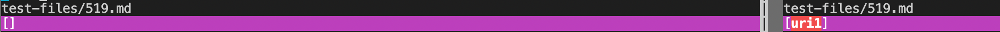
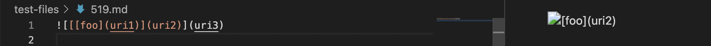

# Week10  Lab report

## Explanation
* Test method: I used ```vimdiff``` to find tests with different results.

* Here's the link for my two test files:
    * [test file 201](https://github.com/HaohanZou/markdown-parser2/blob/main/test-files/201.md)
    * [test file 519](https://github.com/HaohanZou/markdown-parser2/blob/main/test-files/519.md)

## Output Explanation for Test File 201:
* Outputs from my code and test code:


* Original Code and Preview:


    The expected output is [], so MarkdownParse.java from my code produces the correct answer.

* Description of Bugs


    In line 64, we find the index of close bracket "]". Then in line 65, we find the index of open parenthesis "(". Since there isn't a if statement to test if two symbols are next to each other, so it mistakenly include the content in parenthesis into the ArrayList in Test file 519.

## Output Explanation for Test File 519:
* Outputs from my code and test code:



* Original Code and Preview:


    The expected output is [], so MarkdownParse.java from my code produces the correct answer.

* Description of Bugs


    In markdown language, the format for an image is similar to the format of setting a link. The only difference is that there's an additional "!" at the beginning. However, in getLinks method, our goal is to find website links rather than file name or links for images, so we need to start with a if statement to get rid of the case of images. Due to the lack of if statement, in test file 519, this line of command isn't ignored and some contents are considered as a website link added to the output ArrayList.
