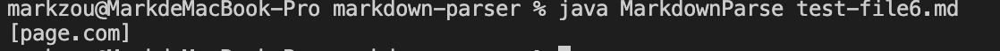

# Week 4 Lab report

## Change 1 - Order of "[]" and "()"

- Change of code in MarkdownParse.java:

- Link to the failure-inducing input:
[test-file.md](test-file.md)

- Symptom of failure-inducing input

- Failure Explanation:

    When we are creating link using markdown language, we need to first use brackets to express the name of the link, and then use parentheses to include the actual link. However, due to our bad memory, we mistakenly made a bug that we found parentheses first and then brackets, which leads to the symptom where the names of links is outputed instead of the acutal links.

## Change 2 - Infinite Loop

- Change of code in MarkdownParse.java:

- Link to the failure-inducing input:
[test-file2.md](test-file2.md)

- Symptom of failure-inducing input

- Failure Explanation:

    In test-file2.md, there exists additional contents after the links. Thus, after we search all the links in the file, the currentindex is still smaller than the lenght of file. Thus, the while loop will never stop and it will search the file again and again and eventually ends up with infinite loop. To fix this problem, we need to add a if statement to test if the while loop search parentheses and brackets of file again. If so, we need to stop the loop immediately.

## Change 3 - Link for Picture
- Change of code in MarkdownParse.java:

- Link to failure-inducing input:
[test-file6.md](test-file6.md)

- Symptom of failure-inducing input

- Failure Explanation
    
    Since the format of adding a photo is similar to the format of creating a link, the program will mistakenly recognize the the link of a photo as a website link, and we will get the symptom that a link of photo is added into the ArrayList of website list. The bug of this program is that we omit a if statement to identify the brackets and parentheses are for website link or for photo. 

    