# Week  Lab report

## Streaming ssh Configuration
* We first open .ssh/config file and add following codes into the file 
```
Host ieng6
    HostName ieng6.ucsd.edu
    User cs15lsp22zzz (use your username)
```

Original File
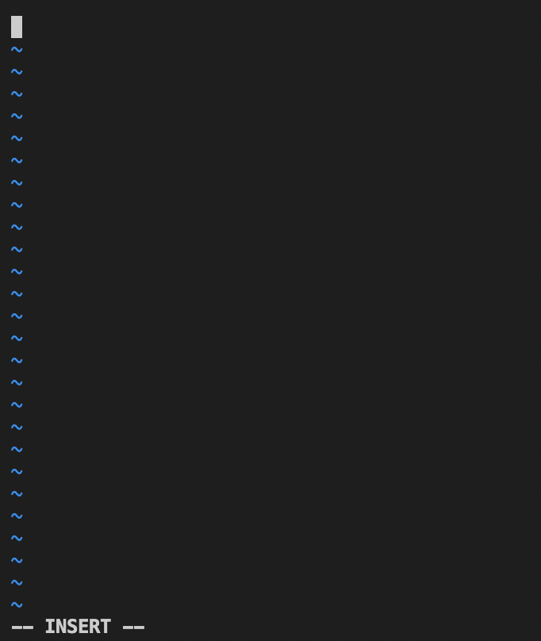

Editted file
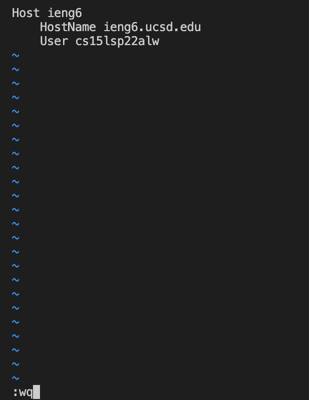

* After we successfully editted the .ssh/config file, now we can try to login our server conmupter with name ieng6 instead of the original cumbersome name.
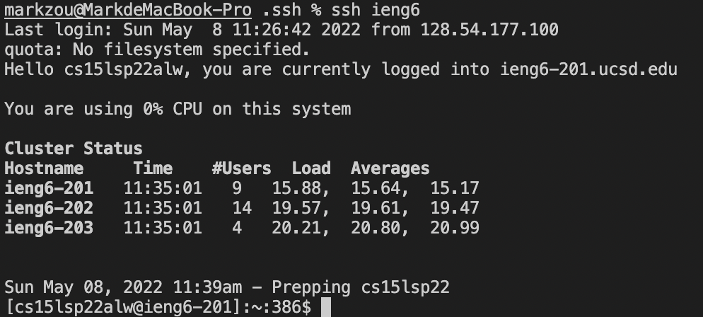

* Now let's try to move a file from our local computer to our server computer with our new convenient login name.
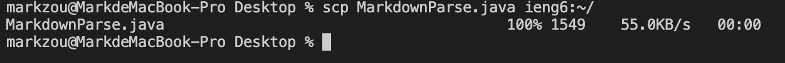

## Setup Github Access from ieng6
* Since we want to connect github with ieng6 server computer, we need to use public key and private key to make a connection. For the first step, we need allocate public key on both ieng6 computer and github webpage. 

`Public key on server computer (id_rsa_github.pub)`
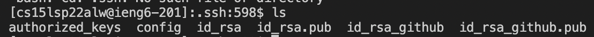

`Public key on Github webpage`
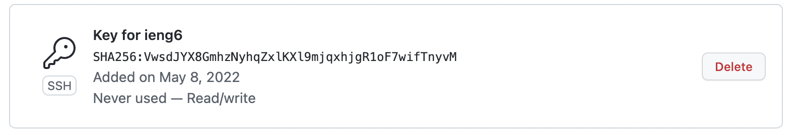

* On server computer, we also need a private key to match with the public key we just distributed.

`Private key on server computer (id_rsa_github)`


* After setting up the pair of keys, we are able to commit and push our changes to github repository
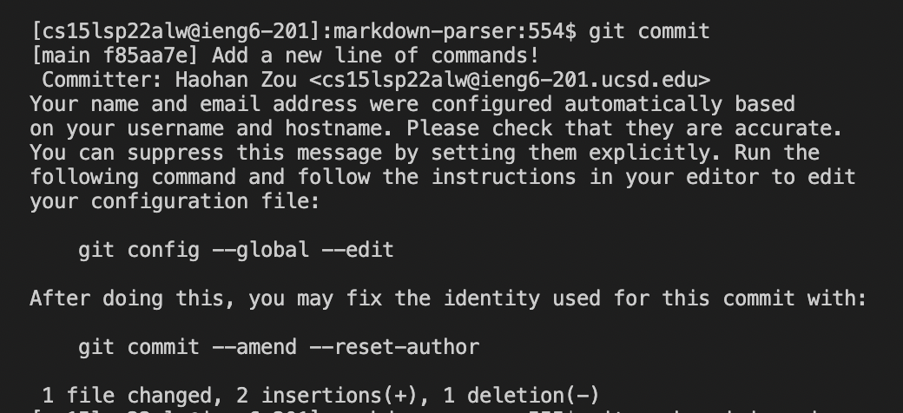
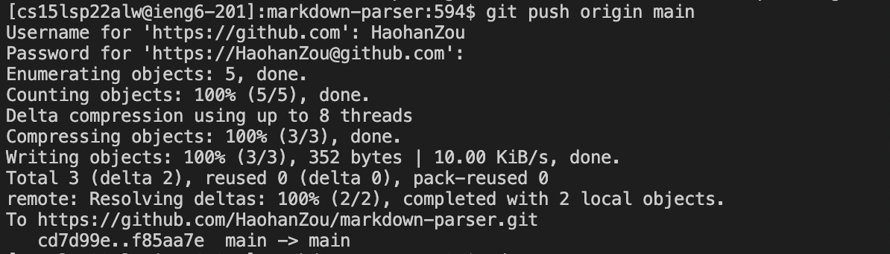 

* Now we are able to find the new commit we made on Github webpage.
[Here's the link for my change](https://github.com/HaohanZou/markdown-parser/commit/f85aa7e3651a7d720217194df8f0a0f11ec07464).


## Copy whole directories with `scp-r`
* Instead of using scp command to move file one by one from local computer to server computer, we are able to use scp -r to move the whole directory to local computer. 
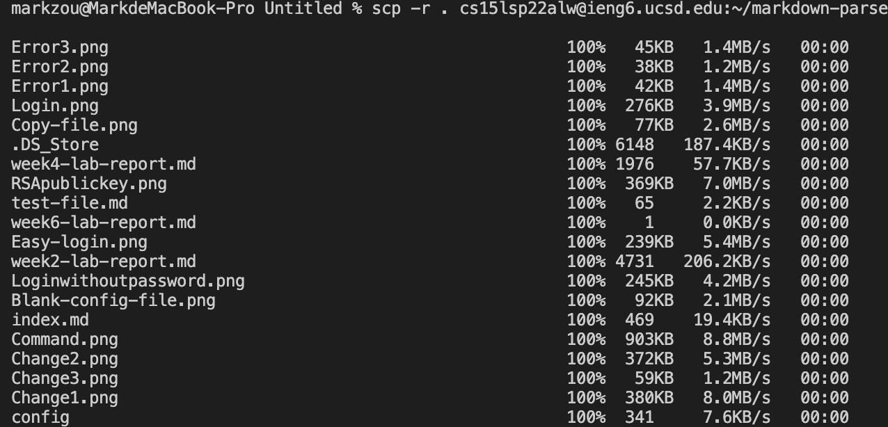

* Now if we check out server computer, we will find an additional direcotry with folder name "markdown-parse"
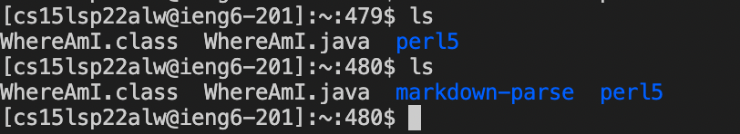

* Now let's try to compile and run the files we just moved to the server computer.
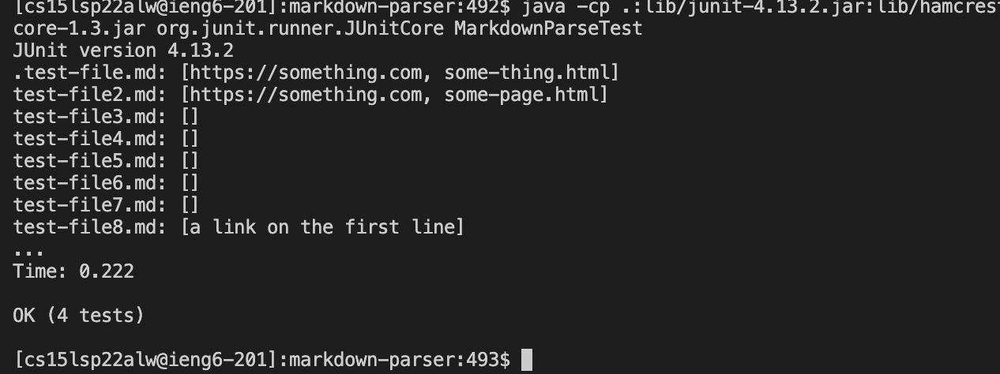

* Since we've learned using ";" to call multiple commands at the same time, so actually we could move folder and compile files inside the folder at the same time. 
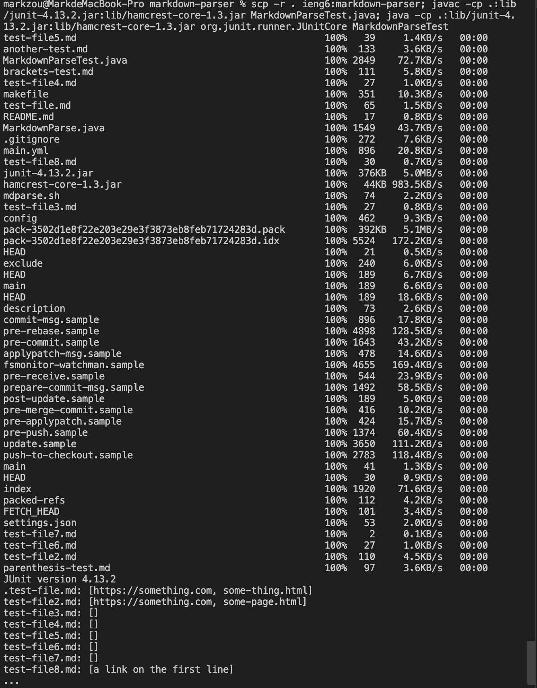


