# Week8  Lab report

## Two Useful Resources for Testing
* Here's the link to my MarkdownParse repository: [click here](https://github.com/ejoa27/markdown-parser.git).

* Here's the link to the reviewed repository: [click here](https://github.com/FishInAZ/makrdown-parse-own.git).

## Testing for Snippet 1
* Here's the code for Snippet 1:

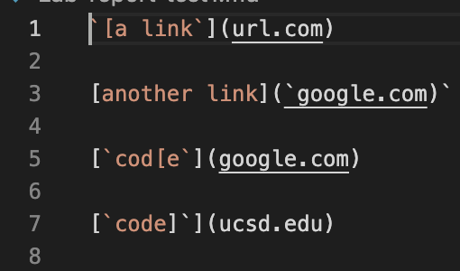

* Here's the expected value of Snippet 1:
```
[url.com, google.com, google.com, ucsd.edu]
```

* Here's the code for my test:
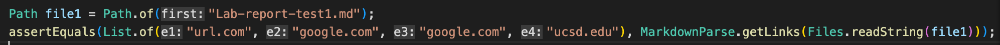

* Here's the code for reviewed test:
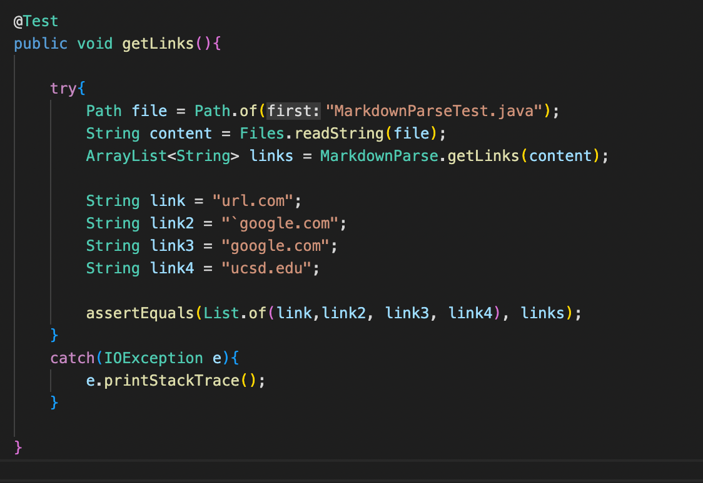

* Junit output in my code:
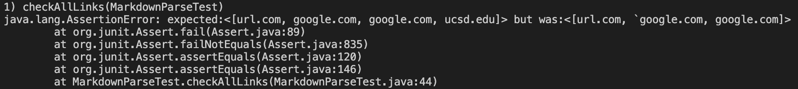

* Junit output in reviewed code:
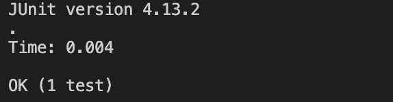

## Testing for Snippet 2
* Here's the code for Snippet 2:
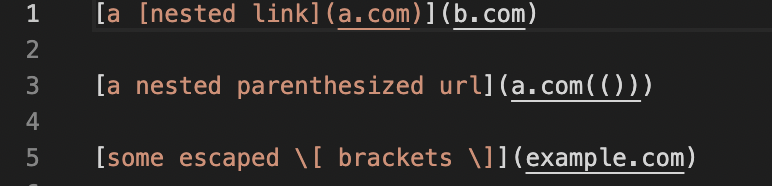

* Here's the expected value of Snippet 2:
```
[a.com, b.com, a.com, example.com]
```

* Here's the code for my test:
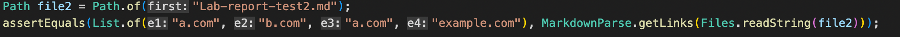

* Here's the code for reviewed test:
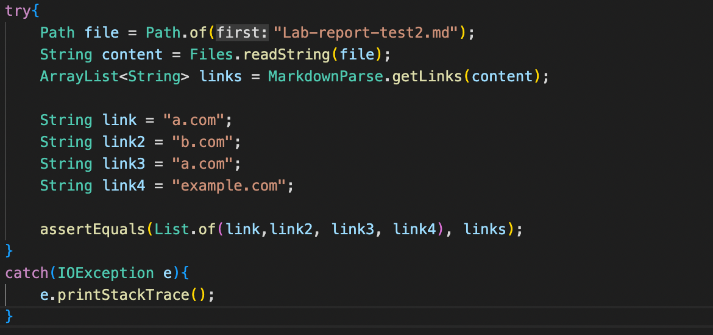

* Junit output in my code:
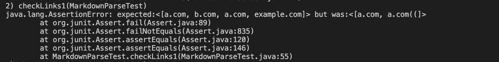

* Junit output in reviewed code:
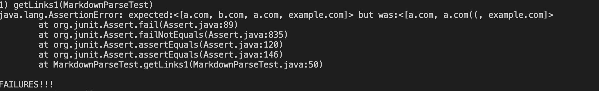


## Testing for Snippet 3
* Here's the code for Snippet 3:
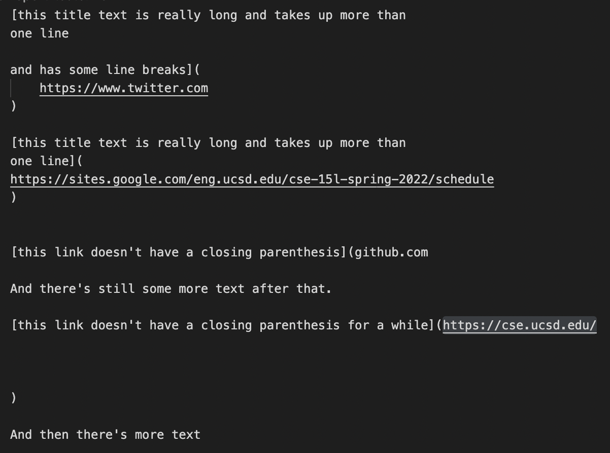

* Here's the expected value of Snippet 3:
```
[https://www.twitter.com, https://sites.google.com/eng.ucsd.edu/cse-15l-spring-2022/schedule, github.com, https://cse.ucsd.edu/]
```

* Here's the code for my test:
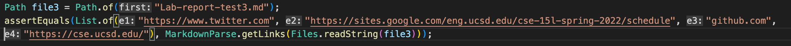

* Here's the code for reviewed test:
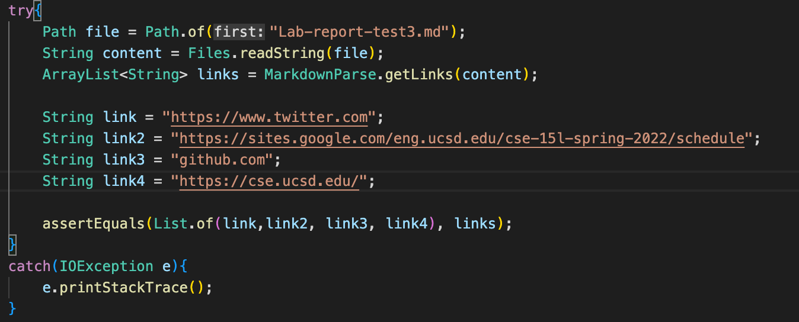

* Here's the expected value of Snippet 3:
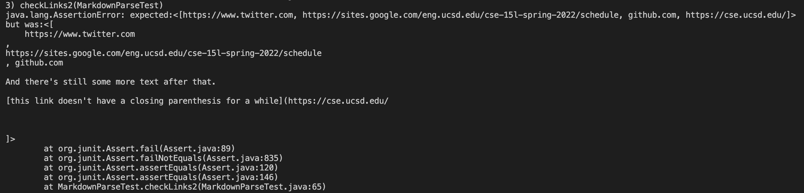

* Here's the expected value of Snippet 3:
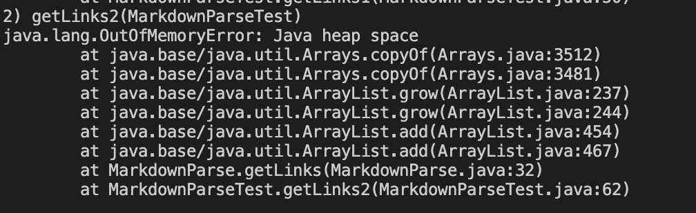

## Answer the following questions
* ### Question 1: Do you think there is a small (<10 lines) code change that will make your program work for snippet 1 and all related cases that use inline code with backticks? If yes, describe the code change. If not, describe why it would be a more involved change. 
    ```
    Answer: In my test, there's a if loop. If the index of close braclet "]" is not one less than  the index of open parentheses "(", then the while loop will break and stop searching for links. If I delete this if condition, then we could get the expected result.


* ### Question 2: Do you think there is a small (<10 lines) code change that will make your program work for snippet 2 and all related cases that nest parentheses, brackets, and escaped brackets? If yes, describe the code change. If not, describe why it would be a more involved change.

    ```
    Answer: Similar to Snippet 1, since I have a if statement to check the relative index of "]" and "(", so the last link is not detected. Another change is that I need to add an another if statement to make sure that the "[" and "]" I find is the same pair, or some link will not be detected. 


* ### Question 3: Do you think there is a small (<10 lines) code change that will make your program work for snippet 3 and all related cases that have newlines in brackets and parentheses? If yes, describe the code change. If not, describe why it would be a more involved change.

    ```
    Answer: Still, my test lacks a if statement to make sure the "[" , "]", "(", and ")" we find are in pairs. However, since in this file, writer missed a ")", so it's not possible to actually find out the link.


